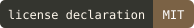
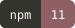
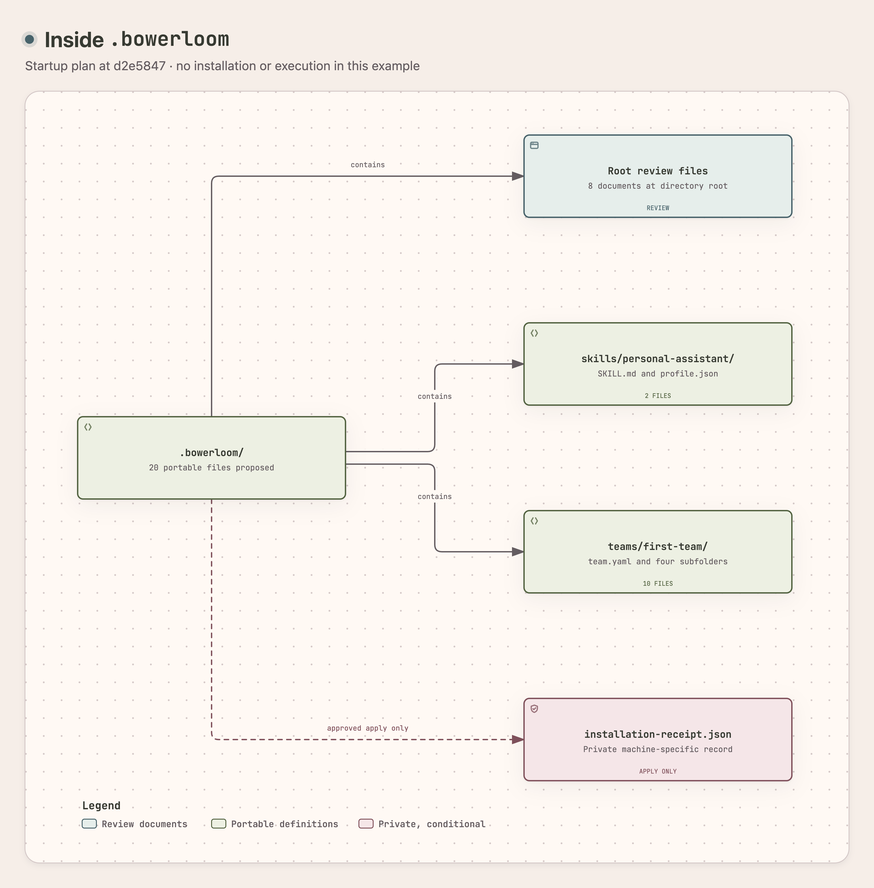

<picture>
  <source media="(prefers-color-scheme: dark)" srcset="docs/assets/readme-beta/exports/hero-dark.png">
  
</picture>

<a id="grow-your-capabilities-with-bowerloom"></a>

# Bring governance to your agent workflows

<p>
  <a href="https://bowerloom.ai/docs/releases/"></a>
  <a href="LICENSE"></a>
  <a href="package.json"></a>
  <a href="#install-bowerloom"></a>
</p>

Bowerloom brings governance to agent workflows in files that follow you. Use your existing personal agent to turn a manual process or a one-to-one agent workflow into defined roles, handoffs, and review points. The beta binds setup-file writes to an exact approved plan, records installed state, detects drift, and supports recorded revision recovery. Your team specification declares proposed access and review expectations, while runtime permissions remain a separate decision. Integrate those definitions with your current project before approving later work.

[Main site](https://bowerloom.ai) · [Documentation](https://bowerloom.ai/docs/) · [Build with your agent](#build-with-your-agent) · [Roadmap](#roadmap)

<a id="release-status"></a>

## Roadmap

Bowerloom moves from project integration in the 0.7 beta toward a stable v1. The dates below are 2026 estimates, not commitments. The optimistic scenario assumes that each stage meets its review criteria without substantial rework. The pessimistic scenario allows more time for fixes and feedback, so later milestones follow the revised earlier stages.

| Stage | Intended outcome | Optimistic estimate | Pessimistic estimate |
| --- | --- | --- | --- |
| 0.7 beta handoff | Put project integration and documented limits in colleagues' hands. | Soft-launch target: Friday, October 9. | Handoff buffer: Tuesday, October 13. Unresolved release defects move the handoff later. |
| 0.7.x capability additions | Add capabilities from observed use and accepted priorities. | October–November. | Additions extend beyond November if fixes or required controls take longer. |
| 1.0 beta | Bring the intended v1 capabilities into a defined, tested scope. | Around December. | After December if the 0.7.x work needs more time. |
| Release candidate | Focus on stability, installation, recovery, security, and documentation. | Toward the end of December. | After the delayed 1.0 beta and its necessary fixes. |
| Stable v1 | Release the version that meets the final criteria. | After a successful release candidate. No confirmed date. | After remaining release-candidate defects are resolved. No confirmed date. |

Capability additions are planned work, not features supplied by the current setup commands. The roadmap does not promise automatic team execution, shared company services, or unattended support. Stable v1 depends on the release candidate's results. It has no assumed calendar date.

[Full roadmap](https://bowerloom.ai/docs/roadmap/)

<picture>
  <source media="(prefers-color-scheme: dark)" srcset="docs/assets/readme-beta/exports/portable-teams-dark.png">
  
</picture>

## Portable teams

Roles, skills, handoffs, and review expectations stay in files that follow you. You can version these definitions with your project and inspect them in another agent application. Their portability does not transfer credentials, approval, or runtime authority. Before sharing a definition, review its project name, goal, and brief for private information. Keep installation receipts, private bindings, credentials, and execution records out of shared files.

The beta's harness commands process selected synthetic configuration files for Codex and Claude Code. They do not change live agent configuration or run models. The separate portable skill installer projects selected files into a new Codex workspace, rather than an existing project. Use the [harness guide](https://bowerloom.ai/docs/harnesses/) and [portable skill guide](https://bowerloom.ai/docs/guides/add-skills/) for their distinct prerequisites and limits.

<picture>
  <source media="(prefers-color-scheme: dark)" srcset="docs/assets/readme-beta/exports/architecture-dark.png">
  
</picture>

## Inside `.bowerloom/`


The setup places the team specification, role prompts, skills, working agreement, and handoff maps under `.bowerloom/` in your project. Planning proposes 20 definition files. Exact approval installs them and adds one private receipt that binds those files to the local project. You can version the definitions with the project, while the receipt and credentials stay private. The tree below lists that installed layout.

<picture>
  <source media="(prefers-color-scheme: dark)" srcset="docs/assets/readme-beta/exports/structure-dark.png">
  
</picture>

```text
.bowerloom/
├── START-HERE.md
├── brief.json
├── manifest.json
├── milestones.md
├── optional-controls.md
├── skills/
│   └── personal-assistant/
│       ├── SKILL.md
│       └── profile.json
├── startup-review.md
├── startup.json
├── teams/
│   └── first-team/
│       ├── assets/
│       │   ├── brief.json
│       │   ├── milestones.md
│       │   └── working-agreement.md
│       ├── maps/
│       │   ├── relay.json
│       │   └── vines.json
│       ├── prompts/
│       │   ├── lead.md
│       │   ├── maker.md
│       │   └── reviewer.md
│       ├── skills/
│       │   └── bounded-draft.md
│       └── team.yaml
├── working-agreement.md
└── installation-receipt.json  [private; created during installation]
```

| Part | What it contains |
| --- | --- |
| `START-HERE.md` and `startup-review.md` | Your goal, proposed setup, first decision, and review instructions |
| `brief.json` | Your explicit project name, goal, profile, and review choices |
| `skills/personal-assistant/` | Guidance and a profile for your existing agent |
| `teams/first-team/` | The team definition, prompts, skill, source assets, and communication and logging maps |
| `working-agreement.md` and `milestones.md` | Responsibilities, boundaries, and review points |
| `manifest.json` and `startup.json` | Bundle contents and startup document references |
| `optional-controls.md` | Instructions for separately approved local connections and registered-work stops |
| `installation-receipt.json` | The private target path, exact approval, file hashes, and compiler evidence |

The maps describe handoffs and logging, but setup does not open connections, start logging services, or schedule work. The generated inventory contains no `.bowerloom/routines/` directory. Private connection bindings, credentials, and runtime state need separate locations and approvals. Their absence from the portable folders keeps definitions separate from local authority.

## Meet the workshop

| Module | Responsibility and current boundary |
| --- | --- |
| Teams | Roles, skills, and permission definitions. Startup produces a specification, without running the team. |
| Relay | Communication definitions and approved local links. A link grants no execution or write authority. |
| Roots | Source-linked knowledge and controlled access. Shared company retrieval and access are outside the documented setup path. |
| Vines | Logs that record work. Startup declares logging maps without a running logging service. |
| Workbench | Repeatable scenarios and comparison records. Setup does not execute a comparison. |

These modules describe responsibilities within a team. Their names do not imply equal runtime support, so use [current support](https://bowerloom.ai/docs/status/) to choose a supported task. MCP connects agent applications to tool servers, but the beta's `mcp plan` command only reads selected synthetic files. It does not contact a server or invoke a tool. The [MCP guide](https://bowerloom.ai/docs/mcp/) explains that planning boundary.

<picture>
  <source media="(prefers-color-scheme: dark)" srcset="docs/assets/readme-beta/exports/approvals-dark.png">
  
</picture>

## Approvals and control

A setup plan identifies the target, inputs, file contents, hashes, and revision that you approve. Changed inputs require another plan, and status reports drift when installed files differ. Revision retains transaction records with supported resume and rollback choices for interrupted changes. These controls govern the planned local file operation. Roles, permissions, and review points in a team definition remain proposed rules until a supported execution path enforces them.

Installation, runtime enrollment, backend setup, and connected actions need their own approvals. The optional `destruct <team-id>` and `destruct all` commands request a stop within the selected local registry, while preserving project files and records. They do not stop unrelated sessions or backend services. A stop request or timeout does not prove cleanup. Read the [stop guide](https://bowerloom.ai/docs/stop/) before selecting that operation.

## Current capabilities

<!-- release:support:start -->
Open beta · 0.7.0-beta.1

Setup does not start workers, grant runtime access, or authorize connected actions.

| Capability | Current boundary |
| --- | --- |
| Setup | Prepare a personal-agent profile, team definition, and working agreement in a new or existing project. Exact approval writes the planned files. |
| Portable skills | Project selected skill files into a new Codex workspace. The installer does not prove discovery or execution. |
| Revision | Plan a change to an installed setup, then approve its exact revision before replacement. |
| Execution | Setup does not start workers, grant runtime access, or authorize connected actions. |
| Harnesses | Synthetic configuration commands support Codex and Claude Code fixtures. They do not run models or change live agent configuration. |
| Connections | MCP planning reads selected synthetic files. Local backend installation requires a separate plan and exact approval. |
| Company | Shared company access, retrieval, offboarding, and deletion are outside this beta's documented setup path. |

These guides use macOS arm64 and Node 24.11.0. Other host systems are outside this documented installation path.

Running a team needs separate runtime permissions and controls. The setup commands do not grant them. Shared company access and unattended services are outside this setup walkthrough.
<!-- release:support:end -->

## Beta limits

Keep your project out of iCloud Drive folders. Project commands such as `bowerloom up`, `ls`, `status`, `apply`, and `skills sync` refuse a project under `~/Documents` or `~/Desktop` when Desktop and Documents sync is on, and under the `~/Library` cloud folders, with `PROJECT_IN_CLOUD_FOLDER`. The older forms that take an explicit path do not run this check. See the [beta limits](https://bowerloom.ai/docs/guides/add-skills/#current-beta-limits).

- No worker starts. `up` ends at `prepared, workers held`.
- Skills come from public sources only. Only MIT and Apache-2.0 skills install.
- `bowerloom revise` refuses once a project holds content added after setup. The fix comes in a later 0.7 release.
- The portable install supports Claude Code and Codex. Native discovery of the installed files has not been observed.

## Install Bowerloom

Bowerloom is an open beta. You receive it as a private archive named `bowerloom-0.7.0-beta.N.tgz`. Replace `N` with the number in the file name. The package is not on the public npm registry.

Install the beta CLI with Node `>=24.11.0 <25` and npm `11`.

```sh
npm install -g ./bowerloom-0.7.0-beta.N.tgz
bowerloom --version
bowerloom --help
```

If npm refuses with a permission error, do not use `sudo`. Set a user prefix for global packages instead. The [install guide](https://bowerloom.ai/docs/start/) shows the steps.

First-team setup does not need Docker. The separate local backend requires Docker Desktop and its own plan and approval.

These guides use macOS arm64 and Node 24.11.0. Other host systems are outside this documented installation path.

## Build with your agent


Start with a workflow you already perform, such as turning an accepted brief into an implementation proposal and reviewing the result. Describe what each step reads, what it produces, who decides, and where work passes to the next person or agent. Your personal agent helps map those responsibilities to a team graph, the tasks and their handoffs. The beta supplies a fixed Engineer, Founder, or Research profile for comparison with that process. It does not import your project or generate an arbitrary graph from a conversation.

The fixed first-team graph gives the lead responsibility for scope, the maker responsibility for a draft, and the reviewer responsibility for critique. The reviewer receives both scope and draft, so review stays tied to the original brief. The specification records these dependencies, role prompts, proposed outputs, and access declarations. Compare them with your actual workflow and working agreement before approving the setup files. The [workflow guide](https://bowerloom.ai/docs/guides/integrate-workflow/) explains the mapping and review steps.

```text
Lead: scope ────→ Maker: draft ────→ Reviewer: review
     └────────────────────────────→ Reviewer: review
```

### Describe the integration

Give your existing personal agent this request:

```text
Help me map my existing manual or one-to-one agent workflow into a Bowerloom team specification for this project.
Ask what each step reads and produces, where work changes hands, and which decisions stay with me.
Compare that process with the fixed Engineer, Founder, or Research profile.
Use my description as input. Ask before reading additional project files.
Show the roles, handoffs, proposed access, working agreement, and exact file plan.
Use bowerloom up in my project folder and show me each plan.
Wait for my approval of the exact plan revision.
After installation, read bowerloom status, .bowerloom/startup-review.md, and .bowerloom/START-HERE.md with me.
Do not import live agent configuration, start workers, or execute the project.
```

<a id="plan-the-setup"></a>

### Prepare the project with one command

Open a terminal in your project folder. Run `up` with a team name and a goal:

```sh
bowerloom up --team "Studio crew" --goal "Prepare a fictional onboarding kit for an independent design studio."
```

`up` shows one next step at a time. The steps are `init`, `team`, `sync`, and `apply`. In a terminal, it asks before each step. An agent passes `--approve <revision>` instead.

<a id="approve-the-exact-files"></a>

Each run without `--approve` prints the plan and its revision, then exits 3. Read the plan. Then run the same command again with the revision:

```sh
bowerloom up --team "Studio crew" --goal "Prepare a fictional onboarding kit for an independent design studio." --approve REVISION_FROM_THE_PLAN
```

Repeat until the project is prepared. The last run prints `prepared, workers held` and exits 4. Exit 4 means a gate holds the workers. It does not mean the command failed.

`up` never edits `AGENTS.md` or `CLAUDE.md`, and it never runs `claude`, `codex`, or any other program.

Exit codes:

- 0 means done.
- 1 means refused.
- 2 means a usage error.
- 3 means approval required.
- 4 means held by a gate.

### Look at the project

```sh
bowerloom ls
bowerloom status
```

`ls` lists the teams, skills, and prompts in `.bowerloom`. `status` shows the setup state, any drift, and any skill you edited by hand. Both commands only read.

Read `.bowerloom/startup-review.md` and `.bowerloom/START-HERE.md` with your personal agent. Compare the team specification, role prompts, handoff map, and working agreement with your process. A successful file installation starts no workers, backend services, or connected tools. If the fixed profile leaves a workflow requirement unmet, record that gap before any later project work. Use [files and configuration](https://bowerloom.ai/docs/configuration/) for the inventory and [revision](https://bowerloom.ai/docs/revision/) for a supported goal or profile change.

### Add and sync third-party skills

Pin a skill at an exact npm version or a full 40-character GitHub commit. Then check, sync, and apply:

```sh
bowerloom skills add npm:<package>@<version>:<path>
bowerloom skills add github:<owner>/<repo>@<40-char-commit>:<path>
bowerloom skills check
bowerloom skills sync
bowerloom apply
```

`skills add` records the pin in `.bowerloom/skills.json` and installs nothing. `skills check` checks every pin offline. `skills sync` installs the pinned skills for Claude Code and Codex. `apply` puts the skills and prompts in place for Claude Code, Codex, or both. Each command that changes files shows a plan first. Read the [skills guide](https://bowerloom.ai/docs/guides/add-skills/) for the refusal codes.

### Create teams, skills, and prompts

```sh
bowerloom team create <name> [--profile engineer|founder|research]
bowerloom skill create <name> [--team <team>]
bowerloom prompt create <name> [--team <team>]
```

These commands write inside `.bowerloom` only. Read [Create teams, skills, and prompts](https://bowerloom.ai/docs/guides/create-items/) for each one.

### Advanced: plan and apply with explicit paths

The older plumbing forms take an absolute target path. They do not check for cloud-synced folders. Replace the example target with your project's absolute directory:

```sh
bowerloom init plan --mode existing --target /absolute/projects/existing-project --profile engineer --name "First team" --goal "Plan an accessible project website and its meaningful checks."
bowerloom init apply --mode existing --target /absolute/projects/existing-project --profile engineer --name "First team" --goal "Plan an accessible project website and its meaningful checks." --approve REPLACE_WITH_EXACT_PLAN_REVISION
bowerloom init status --target /absolute/projects/existing-project
```

Existing mode proposes a new `.bowerloom/` directory while preserving project files and leaving live agent configuration unread. Add `--json` to `init plan` to inspect each file and its hash. Keep the inputs unchanged between plan and apply. An existing `.bowerloom/` installation needs [revision](https://bowerloom.ai/docs/revision/) instead of fresh setup. Run `bowerloom help advanced` for every form.

### Optional separate workspace

If you want a separate unused workspace, use the [new-workspace guide](https://bowerloom.ai/docs/guides/new-workspace/). The primary integration path above keeps your existing project in place.

<picture>
  <source media="(prefers-color-scheme: dark)" srcset="docs/assets/readme-beta/exports/labs-workflow-dark.png">
  
</picture>

## The Labs workflow

The first Sagespec team brought together a Knowledge officer, Brand review, and a Tech lead. Their Bowerloom work connects source knowledge, brand direction, and technical delivery.

| Role | Responsibility |
| --- | --- |
| Knowledge officer | Maintains the wiki and source records, then turns source material into specifications |
| Brand review | Sets the identity and creative direction, delegates design, and reviews the result |
| Tech lead | Defines technical scope, assigns specialists, and brings evidence and decisions to the founder |

The Labs example shows how knowledge, brand, and technical responsibilities connect around a project. Its `v0.7-workbench` label identifies the experiment, rather than the framework version. The example describes the team's responsibilities and does not prove that Bowerloom independently executed that entire team. Sagespec remains private.

## Bugs, questions, and feedback

Report reproducible bugs in [GitHub Issues](https://github.com/sageadvicellc/bowerloom/issues). Search open and closed issues before creating a report.

Include the version, OS, harness, expected result, actual result, reproduction steps, and sanitized logs. Add new evidence to an existing report when applicable.

Ask questions in [Q&A](https://github.com/sageadvicellc/bowerloom/discussions/categories/q-a). Share feedback in [General](https://github.com/sageadvicellc/bowerloom/discussions/categories/general).

Discuss feature proposals in [Ideas](https://github.com/sageadvicellc/bowerloom/discussions/categories/ideas). Describe the task, problem, proposed result, and current workaround.

Read [Bug reports and feedback](https://bowerloom.ai/docs/feedback/) for report examples and privacy guidance. Keep private paths, credentials, and raw receipts private.

## Contributing


Bring a small, reproducible change that the team can review.

- Describe the problem and the result that you expect.
- Include a focused example or meaningful test with your change.
- Follow the [contributor guide](https://bowerloom.ai/docs/contributors/) for source changes and review.

Keep credentials, customer data, and private references out of public issues and pull requests.

Use [GitHub Issues](https://github.com/sageadvicellc/bowerloom/issues) to agree on the scope before a large change.

Made by Sage Advice. [License](LICENSE) · [Source](https://github.com/sageadvicellc/bowerloom).
