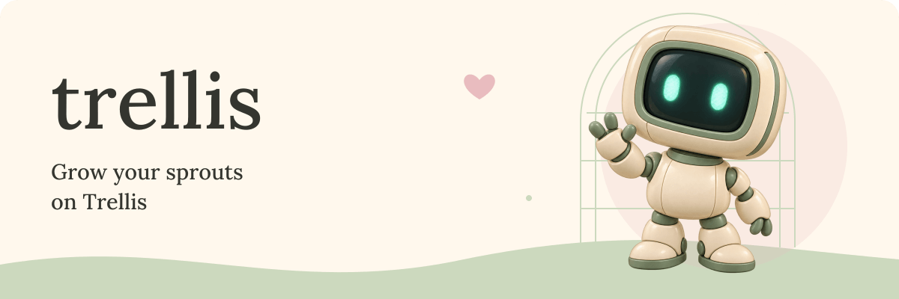

<picture>
  <source media="(prefers-color-scheme: dark)" srcset="docs/assets/trellis-header-dark-v2.png">
  
</picture>

# Grow your sprouts on Trellis


Your ideas deserve a few extra hands.

Trellis is a free, open-source toolkit for agents to build and operate automations. Your personal agent helps turn a routine into a reusable workflow.

Sprouts are your agents. A team brings them together, and a seed gives them a reusable workflow.

Keep your team definitions in files that you can read, change, and version. They live outside any individual agent app.

[Build with your agent](#build-with-your-agent) · [Try the first seed](docs/recipes/labs-to-blog.md) · [Explore the roadmap](docs/transition/release-plan.md)

> [!NOTE]
> `v0.7-alpha` is a local, Codex-first development trial. Repository access is private. The public installer and release are not published. Founder acceptance remains pending.

## Start with one useful routine

The first seed turns a completed Labs experiment into a blog draft. Your personal agent writes the prose from selected evidence.

```text
An experiment → a grounded draft → your approval → a GitHub draft pull request
```

Trellis saves the proposed change and waits for exact approval before the GitHub write. Publication and merging remain separate decisions.

The recorded trial created [draft pull request #41](https://github.com/sageadvicellc/trellis/pull/41). It recovered after a lost response without another write.

This result covers one prepared recipe and installation. It does not establish arbitrary automation or a measured time saving.

[Read the seed guide](docs/recipes/labs-to-blog.md) · [See the recorded result and limits](docs/recipes/live-acceptance.md)

<picture>
  <source media="(prefers-color-scheme: dark)" srcset="docs/assets/trellis-divider-dark.svg">
  
</picture>

## Meet the workshop

| Piece | Its place in Trellis |
| --- | --- |
| Crew | Portable definitions for roles, skills, and permissions |
| Relay | Connections between agents |
| Roots | Knowledge with controlled access |
| Vines | Logs that record the work |
| Workbench | Repeatable scenarios for experiments and tests |

These pieces have different levels of readiness. Read the [alpha evidence](docs/alpha/acceptance-status.md) before you depend on a capability.

Keep credentials and private data outside portable definitions. The current trial uses local private installation files for these details.

## Build with your agent

Start with the [one-page report tutorial](docs/tutorials/one-page-report.md). Your personal agent turns supplied synthetic data into a local report.

Trellis validates an included definition. Your personal agent authors the report separately. This exercise does not execute a Trellis team.


<details>
<summary>Play a short workshop illustration</summary>


This loop illustrates the world of Trellis. It does not show a software startup or an execution result.
GitHub does not provide a reliable reduced-motion control for this GIF. Keep this section closed for the still view.

</details>

Use Node 24.11 or later within Node 24, npm 11, and Git for this development checkout.

```sh
git clone --branch feature/trellis-v1 https://github.com/sageadvicellc/trellis.git
cd trellis
npm ci --ignore-scripts
npm run build
node dist/apps/cli/src/main.js --help
```

From the repository directory, inspect the included offline example:

```sh
node dist/apps/cli/src/main.js validate examples/endor/crew.yaml
```

This command reads the crew definition. It does not start workers or grant execution authority. The example reports `runtimeReady: false` by design.

Give your personal agent this starting request:

```text
Read this Trellis checkout and docs/recipes/labs-to-blog.md.
Help me prepare a blog draft from a selected experiment record.
Keep credentials outside portable definitions.
Show me the exact proposed change before any external write.
Keep publication and merging under my control.
```

From this checkout, replace `trellis` in recipe commands with `node dist/apps/cli/src/main.js`.

The recipe needs a prepared PostgreSQL database and a GitHub App installation. Follow the [recipe instructions](docs/recipes/labs-to-blog.md) before execution.

For personal agents that use MCP, read the [MCP setup guide](apps/mcp/README.md). MCP exposes the same controlled recipe operations as the CLI.

## Keep a hand on the gate

Trellis binds approval to the proposed change. Changed inputs need a new plan. An uncertain write stops for inspection and reconciliation.

The prepared alpha uses a trusted local operator. That boundary does not prove that an approval came from a human.

The recipe uses LangGraph and PostgreSQL for saved progress. Existing Supabase and DBOS controls remain part of the earlier framework work.

The [n8n connection helper](connections/n8n/README.md) is optional. The first GitHub recipe does not require it.

## Help the workshop grow


A small, reproducible contribution gives the team something concrete to review. The artwork above illustrates collaboration, not an implemented repair capability.

- Describe the problem and the result that you expect.
- Include a focused example or test with your proposed change.
- Follow the [working order](docs/transition/working-order.md) for review and branch coordination.

Keep credentials, customer data, and private references out of issues and pull requests. Repository access is required during this private alpha.

## Follow the growing season

| Release | Direction |
| --- | --- |
| `v0.7-alpha` | Codex-first local trial and a reviewed GitHub recipe |
| `v0.7-beta` | Two harnesses, shared teams, retrieval, access, and deletion tests |
| `v1-beta` | Broader framework integration and stress testing |
| `v1-rc` | A release candidate that passes the agreed acceptance gates |

Later rows describe planned work. The [release plan](docs/transition/release-plan.md) defines the gates and scope.

<details>
<summary>Open the workshop notebook</summary>

- [Current alpha evidence and limits](docs/alpha/acceptance-status.md)
- [Prepared local CLI sessions](docs/alpha/local-session.md)
- [Portable Endor alpha template](examples/endor-alpha/README.md)
- [Revised alpha scope](docs/transition/alpha-revision-02.md)
- [Approved alpha build](docs/transition/alpha-build-approval.md)
- [Founder requirements](docs/transition/founder-requirements.md)
- [Branch coordination and merge authority](docs/transition/working-order.md)
- [Monorepo cutover](docs/transition/monorepo-cutover.md)
- [Specification and implementation queue](docs/transition/v1-specification-candidate.md)
- [Research evidence index](docs/transition/evidence-index.md)
- [Research fixtures](experiments/transition/README.md)

</details>

Made by Sage Advice. [License declaration](package.json) · [Source and migration boundaries](docs/transition/monorepo-cutover.md).
